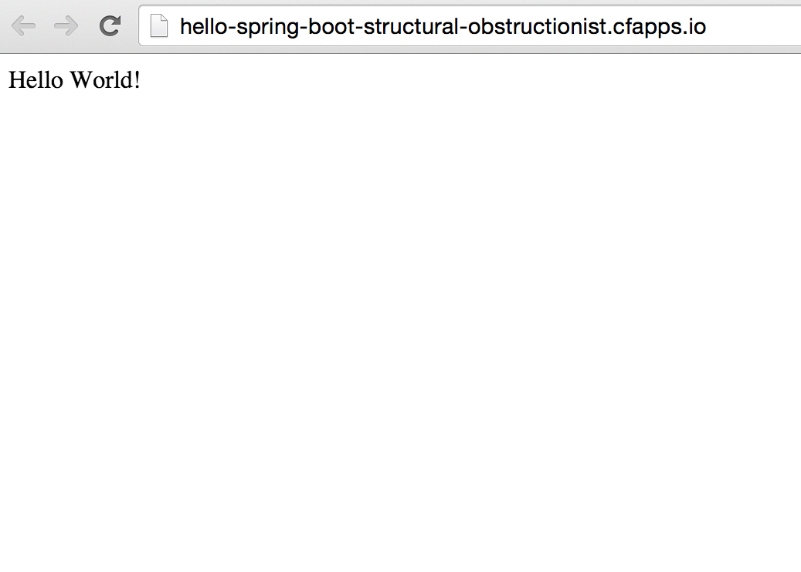

:compat-mode:
= Lab 2 - From Zero to Pushing Your First Application

== Target

. If you haven't already, download the latest release of the Cloud Foundry CLI from https://github.com/cloudfoundry/cli/releases for your operating system and install it.

. Set the API target for the CLI:
+
----
$ cf api api.run.pivotal.io
----

. Login to Pivotal Web Services:
+
----
$ cf login
----
+
Follow the prompts.

== Build and Push!

. Change to the _Hello World_ sample application directory:
+
----
$ cd $COURSE_HOME/labs/initial/hello-spring-boot
----

. Create manifest file that defines how the application should be pushed to PWS.  In the `$COURSE_HOME/labs/initial/hello-spring-boot` directory create a file called `manifest.yml`.
+
Into that file, paste the following configuration properties:
+
----
---
applications:
- name: hello-spring-boot
  memory: 512M
  instances: 1
  host: hello-spring-boot-${random-word}
  path: ./target/hello-spring-boot-0.0.1-SNAPSHOT.jar

----
Visit http://docs.pivotal.io/pivotalcf/devguide/deploy-apps/manifest.html to learn more about deploying with application manifests.

. Using Maven, build and package the application:
+
----
$ mvn package
----
+
Maven will automatically download all of _Hello World_’s dependencies. This may take a few moments.

. Push the application!
+
----
$ cf push
----
+
You should see output similar to the following listing. Take a look at the listing callouts for a play-by-play of what's happening:
+
====
----
Using manifest file /Users/cdecelles/GitHub/cjd-cnw/labs/initial/hello-spring-boot/manifest.yml<1>

Creating app hello-spring-boot in org Northeast / Canada / space cjd as cdecelles@pivotal.io...
OK<2>

Creating route hello-spring-boot-structural-obstructionist.cfapps.io...
OK<3>

Binding hello-spring-boot-structural-obstructionist.cfapps.io to hello-spring-boot...
OK<4>

Uploading hello-spring-boot…<5>
Uploading app files from: /Users/cdecelles/GitHub/cjd-cnw/labs/initial/hello-spring-boot/target/hello-spring-boot-0.0.1-SNAPSHOT.jar
Uploading 525K, 89 files
Done uploading               
OK

Starting app hello-spring-boot in org Northeast / Canada / space cjd as cdecelles@pivotal.io…<6>
-----> Downloaded app package (11M)
-----> Java Buildpack Version: v3.2 | https://github.com/cloudfoundry/java-buildpack.git#3b68024
-----> Downloading Open Jdk JRE 1.8.0_60 from https://download.run.pivotal.io/openjdk/trusty/x86_64/openjdk-1.8.0_60.tar.gz (0.9s)
       Expanding Open Jdk JRE to .java-buildpack/open_jdk_jre (1.0s)<7>
-----> Downloading Open JDK Like Memory Calculator 2.0.0_RELEASE from https://download.run.pivotal.io/memory-calculator/trusty/x86_64/memory-calculator-2.0.0_RELEASE.tar.gz (0.0s)
       Memory Settings: -XX:MaxMetaspaceSize=64M -XX:MetaspaceSize=64M -Xms382293K -Xss995K -Xmx382293K
-----> Downloading Spring Auto Reconfiguration 1.10.0_RELEASE from https://download.run.pivotal.io/auto-reconfiguration/auto-reconfiguration-1.10.0_RELEASE.jar (0.0s)

-----> Uploading droplet (56M)<8>

1 of 1 instances running

App started

OK

App hello-spring-boot was started using this command `CALCULATED_MEMORY=$($PWD/.java-buildpack/open_jdk_jre/bin/java-buildpack-memory-calculator-2.0.0_RELEASE -memorySizes=metaspace:64m.. -memoryWeights=heap:75,metaspace:10,native:10,stack:5 -memoryInitials=heap:100%,metaspace:100% -totMemory=$MEMORY_LIMIT) && SERVER_PORT=$PORT $PWD/.java-buildpack/open_jdk_jre/bin/java -cp $PWD/.:$PWD/.java-buildpack/spring_auto_reconfiguration/spring_auto_reconfiguration-1.10.0_RELEASE.jar -Djava.io.tmpdir=$TMPDIR -XX:OnOutOfMemoryError=$PWD/.java-buildpack/open_jdk_jre/bin/killjava.sh $CALCULATED_MEMORY org.springframework.boot.loader.JarLauncher`<9>

Showing health and status for app hello-spring-boot in org Northeast / Canada / space cjd as cdecelles@pivotal.io…<10>
OK

requested state: started
instances: 1/1
usage: 512M x 1 instances
urls: hello-spring-boot-structural-obstructionist.cfapps.io
last uploaded: Mon Oct 12 15:05:46 UTC 2015

----
<1> The CLI is using a manifest to provide necessary configuration details such as application name, memory to be allocated, and path to the application artifact.
Take a look at `manifest.yml` to see how.
<2> In most cases, the CLI indicates each Cloud Foundry API call as it happens.
In this case, the CLI has created an application record for _Hello World_ in your assigned space.
<3> All HTTP/HTTPS requests to applications will flow through Cloud Foundry's front-end router called http://docs.cloudfoundry.org/concepts/architecture/router.html[(Go)Router].
Here the CLI is creating a route with random word tokens inserted (again, see `manifest.yml` for a hint!) to prevent route collisions across the default `cfapps.io` domain.
<4> Now the CLI is _binding_ the created route to the application.
Routes can actually be bound to multiple applications to support techniques such as http://www.mattstine.com/2013/07/10/blue-green-deployments-on-cloudfoundry[blue-green deployments].
<5> The CLI finally uploads the application bits to PWS. Notice that it's uploading _90 files_! This is because Cloud Foundry actually explodes a ZIP artifact before uploading it for caching purposes.
<6> Now we begin the staging process. The https://github.com/cloudfoundry/java-buildpack[Java Buildpack] is responsible for assembling the runtime components necessary to run the application.
<7> Here we see the version of the JRE that has been chosen and installed.
<8> The complete package of your application and all of its necessary runtime components is called a _droplet_.
Here the droplet is being uploaded to PWS's internal blobstore so that it can be easily copied to one or more _http://docs.cloudfoundry.org/concepts/architecture/execution-agent.html[Droplet Execution Agents (DEA's)]_ for execution.
<9> The CLI tells you exactly what command and argument set was used to start your application.
<10> Finally the CLI reports the current status of your application's health.
You can get the same output at any time by typing `cf app hello-spring-boot`.
====

. Visit the application in your browser by hitting the route that was generated by the CLI:
+
