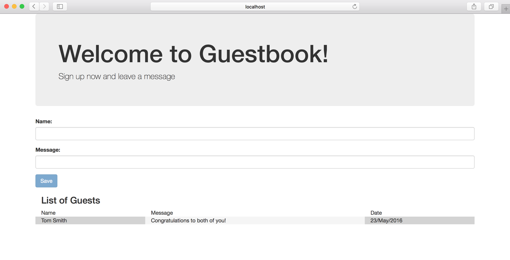
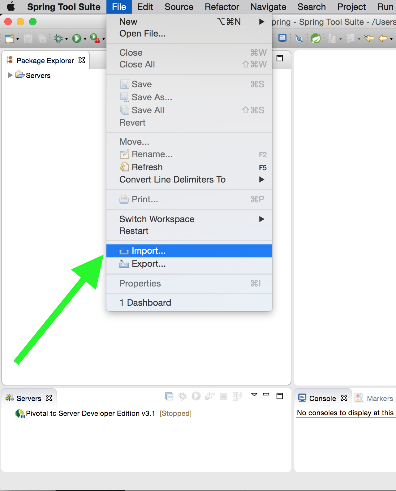
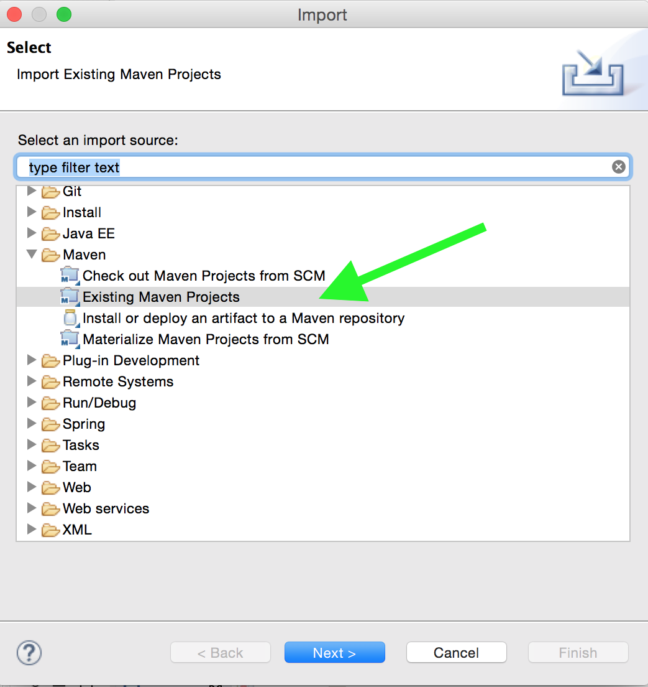
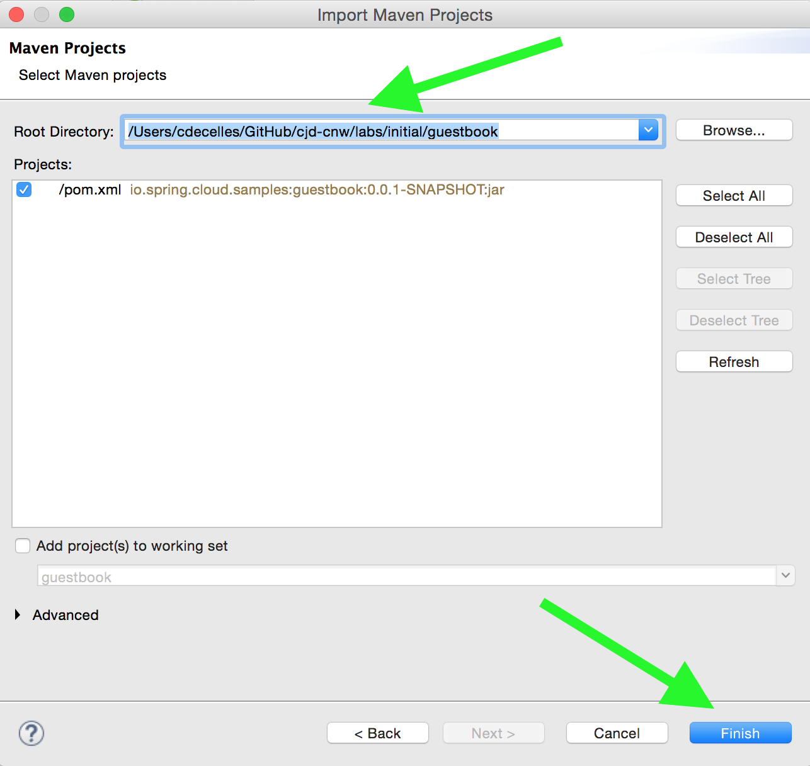
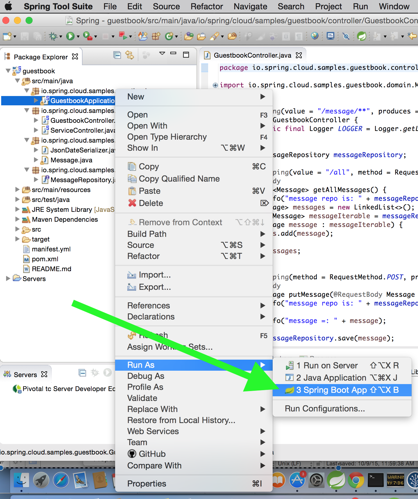
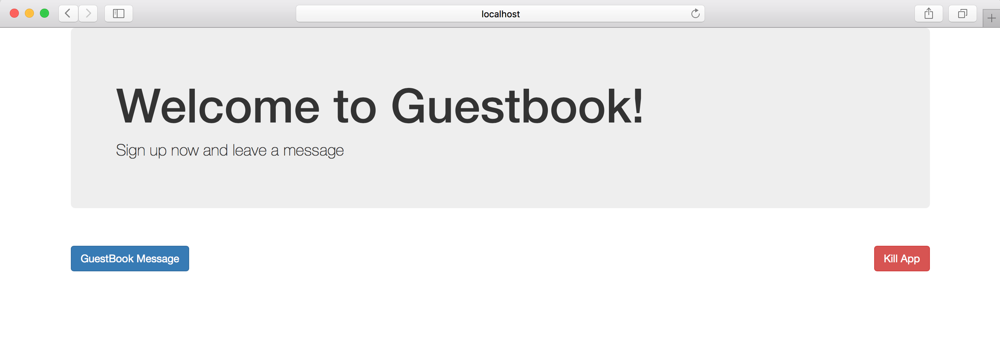
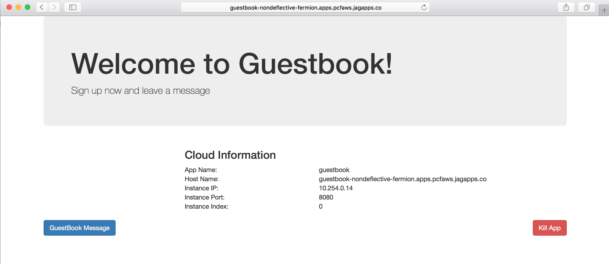

:compat-mode:
= Lab 3 - Creating a guestbook application that persists data.

In this lab we're going to build a Guestbook application that allows the user to enter information in the U/I.
The resulting application looks like the following screenshot:

== Bootstrapping

. Choose *File -> Import*:
+

. Choose *Maven -> Existing Maven Projects*:
+

. Choose the project's `pom.xml`, found at `$COURSE_HOME/labs/initial/guestbook` and click *Finish*.
+

== Create the JPA domain class

All guestbook entries will be stored in a database.

. Create a JPA domain class, `io.spring.cloud.samples.guestbook.domain.Message`.
Into that class, paste the following code:
+
----
@Entity
@Table(name = "Message")
public class Message implements Serializable {

  @Id
  @GeneratedValue(strategy = GenerationType.AUTO)
  private Long id;

  @Column(nullable = false)
  private String name;

  @Column(nullable = false, length = 1024)
  private String message;

  private Date created;
  
  protected Message(){
	    this.created = new Date();
  }

  public Message(String name, String message) {
    this.name = name;
    this.message = message;
    this.created = new Date();
  }

  public Long getId() {
    return id;
  }

  public String getName() {
    return name;
  }

  public void setName(String name) {
    this.name = name;
  }

  public String getMessage() {
    return message;
  }

  public void setMessage(String message) {
    this.message = message;
  }
  
  @JsonSerialize(using=JsonDateSerializer.class)
  public Date getCreated() {
    return created;
  }

  @Override
  public String toString() {
    final StringBuilder sb = new StringBuilder("Message{");
    sb.append("id=").append(id);
    sb.append(", name='").append(name).append('\'');
    sb.append(", message='").append(message).append('\'');
    sb.append(", created=").append(created);
    sb.append('}');
    return sb.toString();
  }
}
----
+
Add the appropriate imports using the IDE's quick fix feature.
+
This class represents the domain model for a message. It has a unique identifier, the name of the person adding the message and the message's.

. Next, create the package `io.spring.cloud.samples.guestbook.repositories`.

. Create a Spring Data JPA repository interface, `io.spring.cloud.samples.guestbook.repositories.MessageRepository`.
Into that class, paste the following code:
+
----
public interface MessageRepository extends CrudRepository<Message, Long> {

}
----
+
Add the appropriate imports using the IDE's quick fix feature.
+
This interface will provide all of the basic boilerplate CRUD features we'll want for our `Message` domain class.

== Guestbook Controller

Next we’ll create a Spring MVC Controller that will be responsible for displaying and updating the guestbook.

. Create the Guestbook controller class, `io.spring.cloud.samples.guestbook.controller.GuestbookController`.
Into that class, paste the following code:
+
----
@Controller
@RequestMapping(value = "/message/**", produces = "application/json")
public class GuestbookController {
  public static final Logger LOGGER = Logger.getLogger(GuestbookController.class.getName());

  @Autowired
  private MessageRepository messageRepository;

  @RequestMapping(value = "/all", method = RequestMethod.GET, produces = "application/json")
  @ResponseBody
  public List<Message> getAllMessages() {
    LOGGER.info("message repo is: " + messageRepository);
    List<Message> messages = new LinkedList<>();
    Iterable<Message> messageIterable = messageRepository.findAll();
    for (Message message : messageIterable) {
      messages.add(message);
    }
    return messages;
  }

  @RequestMapping(method = RequestMethod.POST, produces = "application/json")
  @ResponseBody
  public Message putMessage(@RequestBody Message message) {
    LOGGER.info("message repo is: " + messageRepository);

    return messageRepository.save(message);
  }
}

----
+
Add the appropriate imports using the IDE's quick fix feature.
+
This class represents the controller for the guestbook.

== Running the application

. Right click on `io.spring.cloud.samples.guestbook.GuestbookApplication` and choose *Run As -> Spring Boot App*:
+

. Browse to http://localhost:8085.
You should see output similar to the following:
+

. Click Guestbook Message and add a message. You should see output similar to following:
+

== Build and Push!

. Change to the _Guestbook_ sample application directory:
+
----
$ cd $COURSE_HOME/labs/initial/guestbook
----

. Using Maven, build and package the application:
+
----
$ mvn package
----
+
Maven will automatically download all of _Guestbook_’s dependencies. This may take a few moments.

. Push the application!
+
----
$ cf push
----
+

. Visit the application in your browser by hitting the route that was generated by the CLI:

+

