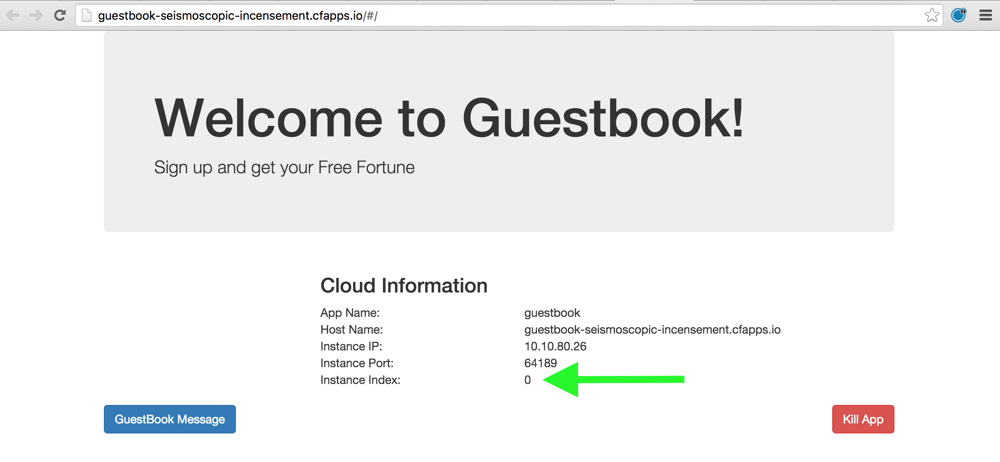
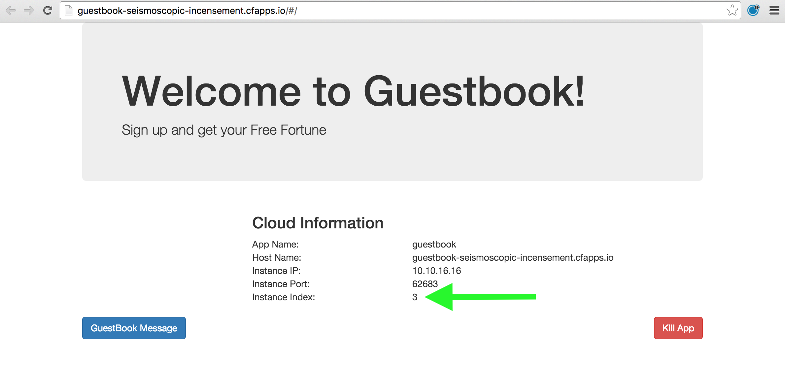
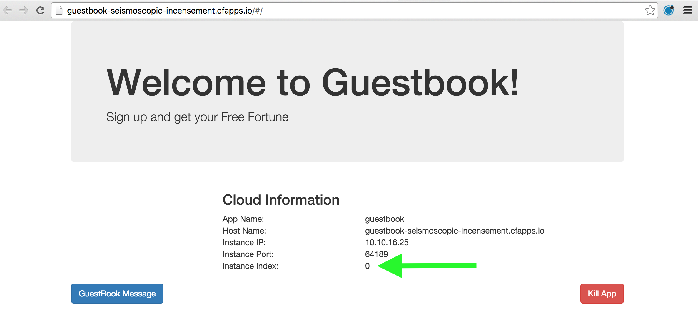

:compat-mode:
= Lab 5 - Scaling Applications

[abstract]
--
Cloud Foundry makes the work of horizontally scaling application instances and updating load balancer routing tables easy.

In this lab, we'll use the Guestbook app to illustrate Cloud Foundry operations such as scaling.
--

== Scale the Application Up

. Visit the application in your browser by hitting the route that was generated by the CLI in the previous exercise:
+

+
You'll see that the application is reporting various bits of information that it has discovered from its environment.
Of primary interest is that this application reports its _instance index_.

. Now let's increase the number of running application instances to 5:
+
----
$ cf scale -i 5 guestbook
Scaling app guestbook in org Northeast / Canada / space cjd as cdecelles@pivotal.io...
OK
----
+
In reporting `OK`, the CLI is letting you know that the additional requested instances have been started, but they are not yet necessarily running.

. We can determine how many instances are actually running like this:
+
====
----
$ cf app guestbook
Showing health and status for app guestbook in org Northeast / Canada / space cjd as cdecelles@pivotal.io...
OK

requested state: started
instances: 2/5
usage: 512M x 5 instances
urls: guestbook-maggoty-nonpeltast.cfapps.io, guestbook-seismoscopic-incensement.cfapps.io
last uploaded: Tue Oct 13 13:05:20 UTC 2015
stack: cflinuxfs2
buildpack: java-buildpack=v3.2-https://github.com/cloudfoundry/java-buildpack.git#3b68024 java-main open-jdk-like-jre=1.8.0_60 open-jdk-like-memory-calculator=2.0.0_RELEASE postgresql-jdbc=9.4.1204 spring-auto-reconfiguration=1.10.0_RELEASE

     state      since                    cpu    memory           disk           details   
#0   running    2015-10-13 09:06:11 AM   0.1%   443.5M of 512M   173.1M of 1G   <1>   
#1   starting   2015-10-13 09:24:17 AM   0.0%   0 of 0           0 of 0  <2>          
#2   starting   2015-10-13 09:24:17 AM   0.0%   0 of 0           0 of 0            
#3   starting   2015-10-13 09:24:17 AM   0.0%   0 of 0           0 of 0            
#4   starting   2015-10-13 09:24:17 AM   0.0%   0 of 0           0 of 0       

----
<1> This application instance has completed the startup process and is actually able to accept requests.
<2> This application instance is still starting and will not have any requests routed to it.
====

. Eventually all instances will converge to a running state:
+
----
$ cf app guestbook
Showing health and status for app guestbook in org Northeast / Canada / space cjd as cdecelles@pivotal.io...
OK

requested state: started
instances: 5/5
usage: 512M x 5 instances
urls: guestbook-maggoty-nonpeltast.cfapps.io, guestbook-seismoscopic-incensement.cfapps.io
last uploaded: Tue Oct 13 13:05:20 UTC 2015
stack: cflinuxfs2
buildpack: java-buildpack=v3.2-https://github.com/cloudfoundry/java-buildpack.git#3b68024 java-main open-jdk-like-jre=1.8.0_60 open-jdk-like-memory-calculator=2.0.0_RELEASE postgresql-jdbc=9.4.1204 spring-auto-reconfiguration=1.10.0_RELEASE

     state     since                    cpu    memory           disk           details   
#0   running   2015-10-13 09:06:11 AM   0.1%   443.5M of 512M   173.1M of 1G      
#1   running   2015-10-13 09:25:17 AM   0.0%   443.2M of 512M   173.1M of 1G      
#2   running   2015-10-13 09:24:38 AM   0.2%   430M of 512M     173.1M of 1G      
#3   running   2015-10-13 09:24:39 AM   0.2%   430.1M of 512M   173.1M of 1G      
#4   running   2015-10-13 09:24:37 AM   0.0%   0 of 0           0 of 0            

----

. Revisit the application route in the browser.
Refresh several times.
You should observe the instance index changing as you do so:
+

+
The aforementioned http://docs.cloudfoundry.org/concepts/architecture/router.html[(Go)Router] is applying a random routing algorithm to all of the application instances assigned to this route.
As an instance reaches the `running` state, its http://docs.cloudfoundry.org/concepts/architecture/execution-agent.html[DEA] registers that instance in the routing table assigned to its route by sending a message to Cloud Foundry's message bus.
All (Go)Router instances are subscribed to this channel and register the routes independently.
This makes for very dynamic and rapid reconfiguration!

== Scale the Application Down

. We can scale the application instances back down as easily as we scaled them up, using the same command structure:
+
----
$ cf scale -i 1 guestbook
Scaling app guestbook in org Northeast / Canada / space cjd as cdecelles@pivotal.io...
OK
----

. Check the application status again:
+
----
$ cf app guestbook
Showing health and status for app guestbook in org Northeast / Canada / space cjd as cdecelles@pivotal.io...
OK

requested state: started
instances: 1/1
usage: 512M x 1 instances
urls: guestbook-maggoty-nonpeltast.cfapps.io, guestbook-seismoscopic-incensement.cfapps.io
last uploaded: Tue Oct 13 13:05:20 UTC 2015
stack: cflinuxfs2
buildpack: java-buildpack=v3.2-https://github.com/cloudfoundry/java-buildpack.git#3b68024 java-main open-jdk-like-jre=1.8.0_60 open-jdk-like-memory-calculator=2.0.0_RELEASE postgresql-jdbc=9.4.1204 spring-auto-reconfiguration=1.10.0_RELEASE

     state     since                    cpu    memory           disk           details   
#0   running   2015-10-13 09:06:11 AM   0.1%   443.5M of 512M   173.1M of 1G      
----
+
As you can see, we're back down to only one instance running, and it is in fact the original index 0 that we started with.

. Confirm that by again revisiting the route in the browser and checking the instance index:
+
