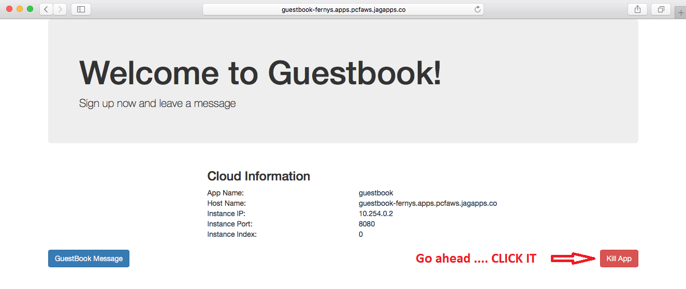
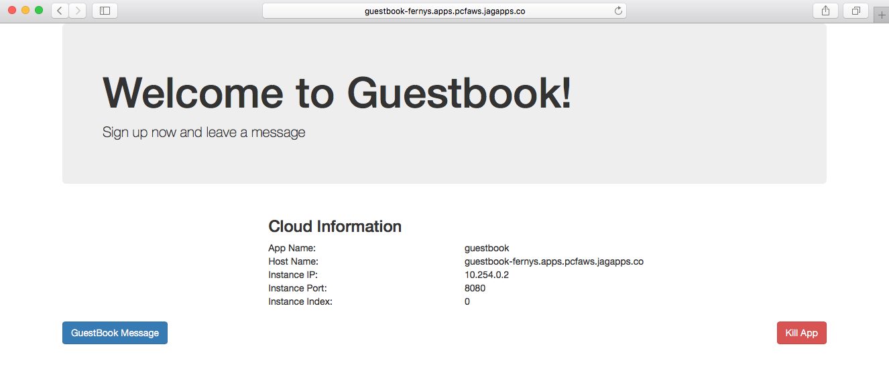

:compat-mode:
= Lab 6 - Monitoring, Logging and Health 

Cloud Foundry provides several built-in mechanisms that allow us to monitor our applications' state changes and behavior.
Additionally, Cloud Foundry actively monitors the health of our application processes and will restart them should they crash.
In this lab, we'll explore a few of these mechanisms.

== Using Spring Actuator

. Change to the lab directory:
+
----
$ cd $COURSE_HOME/labs/initial/guestbook
----

. To `pom.xml` add the following dependency to include the starter for Spring Boot Actuator:
+
----
<dependency>
	<groupId>org.springframework.boot</groupId>
	<artifactId>spring-boot-starter-actuator</artifactId>
</dependency>
----

== Introspection Endpoints

. Build the application:
+
----
$ mvn package
----

. Run the application:
+
----
$ java -jar target/guestbook-0.0.1-SNAPSHOT.jar
----

. Try out the following endpoints. The output is omitted here because it can be quite large:
+
http://localhost:8085/beans:: Dumps all of the beans in the Spring context.
http://localhost:8085/autoconfig:: Dumps all of the auto-configuration performed as part of application bootstrapping.
http://localhost:8085/configprops:: Displays a collated list of all `@ConfigurationProperties`.
http://localhost:8085/env:: Dumps the application's shell environment as well as all Java system properties.
http://localhost:8085/mappings:: Dumps all URI request mappings and the controller methods to which they are mapped.
http://localhost:8085/dump:: Performs a thread dump.
http://localhost:8085/trace:: Displays trace information (by default the last few HTTP requests).

== Events

Cloud Foundry only allows application configuration to be modified via its API.
This gives application operators confidence that all changes to application configuration are known and auditable.
It also reduces the number of causes that must be considered when problems arise.

All application configuration changes are recorded as _events_.
These events can be viewed via the Cloud Foundry API, and viewing is facilitated via the CLI.

Take a look at the events that have transpired so far for our deployment of `guestbook`:

====
----
$ cf events guestbook
Getting events for app guestbook in org Northeast / Canada / space cjd as cdecelles@pivotal.io...

time                          event                 actor                  description     
2015-10-13T09:24:08.00-0400   audit.app.update      cdecelles@pivotal.io   instances: 1 <6>
2015-10-13T09:16:01.00-0400   audit.app.update      cdecelles@pivotal.io   instances: 5 <5>  
2015-10-13T09:05:27.00-0400   audit.app.update      cdecelles@pivotal.io   state: STARTED <4> 
2015-10-13T09:05:23.00-0400   audit.app.update      cdecelles@pivotal.io   state: STOPPED   
2015-10-13T09:04:57.00-0400   audit.app.update      cdecelles@pivotal.io  <3>    
2015-10-13T09:04:57.00-0400   audit.app.map-route   cdecelles@pivotal.io  <2>        
2015-10-12T15:14:24.00-0400   audit.app.create      cdecelles@pivotal.io   instances: 1, memory: 512, state: STOPPED, environment_json: PRIVATE DATA HIDDEN <1>

----
<1> Events are sorted newest to oldest, so we'll start from the bottom.
Here we see the `app.create` event, which created our application's record and stored all of its metadata (e.g. `memory: 512`).
<2> The `app.map-route` event records the incoming request to assign a route to our application.
<3> This `app.update` event records the resulting change to our applications metadata.
<4> This `app.update` event records the change of our application's state to `STARTED`.
<5> Remember scaling the application up? This `app.update` event records the metadata change `instances: 5`.
<6> And here's the `app.update` event recording our scaling of the application back down with `instances: 1`.
====

. Let's explicitly ask for the application to be stopped:
+
----
$ cf stop guestbook
Stopping app guestbook in org Northeast / Canada / space cjd as cdecelles@pivotal.io...
OK
----

. Now, examine the additional `app.update` event:
+
----
$ cf events guestbook
Getting events for app guestbook in org Northeast / Canada / space cjd as cdecelles@pivotal.io...

time                          event                 actor                  description   
2015-10-13T09:47:15.00-0400   audit.app.update      cdecelles@pivotal.io   state: STOPPED     
2015-10-13T09:24:08.00-0400   audit.app.update      cdecelles@pivotal.io   instances: 1   
2015-10-13T09:16:01.00-0400   audit.app.update      cdecelles@pivotal.io   instances: 5   
2015-10-13T09:05:27.00-0400   audit.app.update      cdecelles@pivotal.io   state: STARTED   
2015-10-13T09:05:23.00-0400   audit.app.update      cdecelles@pivotal.io   state: STOPPED   
2015-10-13T09:04:57.00-0400   audit.app.update      cdecelles@pivotal.io      
2015-10-13T09:04:57.00-0400   audit.app.map-route   cdecelles@pivotal.io          
2015-10-12T15:14:24.00-0400   audit.app.create      cdecelles@pivotal.io   instances: 1, memory: 512, state: STOPPED, environment_json: PRIVATE DATA HIDDEN   

----

. Start the application again:
+
----
$ cf start guestbook
Starting app guestbook in org Northeast / Canada / space cjd as cdecelles@pivotal.io...

0 of 1 instances running, 1 starting
0 of 1 instances running, 1 starting
0 of 1 instances running, 1 starting
1 of 1 instances running

App started

OK

App guestbook was started using this command `CALCULATED_MEMORY=$($PWD/.java-buildpack/open_jdk_jre/bin/java-buildpack-memory-calculator-2.0.0_RELEASE -memorySizes=metaspace:64m.. -memoryWeights=heap:75,metaspace:10,native:10,stack:5 -memoryInitials=heap:100%,metaspace:100% -totMemory=$MEMORY_LIMIT) && SERVER_PORT=$PORT $PWD/.java-buildpack/open_jdk_jre/bin/java -cp $PWD/.:$PWD/.java-buildpack/postgresql_jdbc/postgresql_jdbc-9.4.1204.jar:$PWD/.java-buildpack/spring_auto_reconfiguration/spring_auto_reconfiguration-1.10.0_RELEASE.jar -Djava.io.tmpdir=$TMPDIR -XX:OnOutOfMemoryError=$PWD/.java-buildpack/open_jdk_jre/bin/killjava.sh $CALCULATED_MEMORY org.springframework.boot.loader.JarLauncher`

Showing health and status for app guestbook in org Northeast / Canada / space cjd as cdecelles@pivotal.io...
OK

requested state: started
instances: 1/1
usage: 512M x 1 instances
urls: guestbook-maggoty-nonpeltast.cfapps.io, guestbook-seismoscopic-incensement.cfapps.io
last uploaded: Tue Oct 13 13:05:20 UTC 2015
stack: cflinuxfs2
buildpack: java-buildpack=v3.2-https://github.com/cloudfoundry/java-buildpack.git#3b68024 java-main open-jdk-like-jre=1.8.0_60 open-jdk-like-memory-calculator=2.0.0_RELEASE postgresql-jdbc=9.4.1204 spring-auto-reconfiguration=1.10.0_RELEASE

     state     since                    cpu    memory           disk           details   
#0   running   2015-10-13 09:49:28 AM   0.0%   443.1M of 512M   173.1M of 1G
----

. And again, view the additional `app.update` event:
+
----
$ cf events guestbook
Getting events for app guestbook in org Northeast / Canada / space cjd as cdecelles@pivotal.io...

time                          event                 actor                  description   
2015-10-13T09:49:04.00-0400   audit.app.update      cdecelles@pivotal.io   state: STARTED 
2015-10-13T09:47:15.00-0400   audit.app.update      cdecelles@pivotal.io   state: STOPPED     
2015-10-13T09:24:08.00-0400   audit.app.update      cdecelles@pivotal.io   instances: 1   
2015-10-13T09:16:01.00-0400   audit.app.update      cdecelles@pivotal.io   instances: 5   
2015-10-13T09:05:27.00-0400   audit.app.update      cdecelles@pivotal.io   state: STARTED   
2015-10-13T09:05:23.00-0400   audit.app.update      cdecelles@pivotal.io   state: STOPPED   
2015-10-13T09:04:57.00-0400   audit.app.update      cdecelles@pivotal.io      
2015-10-13T09:04:57.00-0400   audit.app.map-route   cdecelles@pivotal.io          
2015-10-12T15:14:24.00-0400   audit.app.create      cdecelles@pivotal.io   instances: 1, memory: 512, state: STOPPED, environment_json: PRIVATE DATA HIDDEN  
----

== Logs

One of the most important enablers of visibility into application behavior is logging.
Effective management of logs has historically been very difficult.
Cloud Foundry's https://github.com/cloudfoundry/loggregator[log aggregation] components simplify log management by assuming responsibility for it.
Application developers need only log all messages to either `STDOUT` or `STDERR`, and the platform will capture these messages.

=== For Developers

Application developers can view application logs using the CF CLI.

. Let's view recent log messages for `guestbook`:
+
----
$ cf logs guestbook --recent
----
+
Here are two interesting subsets of one output from that command:
+
.CF Component Logs
====
----
2016-05-25T18:26:49.61-0400 [API/0]      OUT Updated app with guid 1f9098dc-7a6b-477b-9169-df6cac884d4a ({"instances"=>2})
2016-05-25T18:26:49.62-0400 [CELL/1]     OUT Creating container
2016-05-25T18:28:15.38-0400 [RTR/0]      OUT guestbook-fernys.apps.pcfaws.jagapps.co - [25/05/2016:22:28:15.327 +0000] "GET /cloudinfo HTTP/1.1" 200 0 640
----
<1> An API log event that corresponds to an event as shown in `cf events`
<2> A CELL log event indicating the creation of a container inside that Cell.
<3> An ``Apache-style'' access log event from the (Go)Router
====
+
.Application Logs
====
----
2016-05-25T18:27:08.31-0400 [APP/1]      OUT 2016-05-25 22:27:08.316  INFO 18 --- [           main] o.s.i.endpoint.EventDrivenConsumer       : started org.springframework.integration.config.ConsumerEndpointFactoryBean#0
2016-05-25T18:27:08.31-0400 [APP/1]      OUT 2016-05-25 22:27:08.316  INFO 18 --- [           main] o.s.c.support.DefaultLifecycleProcessor  : Starting beans in phase 2147483647
2016-05-25T18:27:08.39-0400 [APP/1]      OUT 2016-05-25 22:27:08.397  INFO 18 --- [           main] s.b.c.e.t.TomcatEmbeddedServletContainer : Tomcat started on port(s): 8080 (http)
2016-05-25T18:27:08.40-0400 [APP/1]      OUT 2016-05-25 22:27:08.399  INFO 18 --- [           main] i.s.c.s.guestbook.GuestbookApplication   : Started GuestbookApplication in 13.216 seconds (JVM running for 13.838)
----
====
+
As you can see, Cloud Foundry's log aggregation components capture both application logs and CF component logs relevant to your application.
These events are properly interleaved based on time, giving you an accurate picture of events as they transpired across the system.

. To get a running ``tail'' of the application logs rather than a dump, simply type:
+
----
$ cf logs guestbook
----
+
You can try various things like refreshing the browser and triggering stop/start events to see logs being generated.

=== For Operators (OPTIONAL)

Application operators will also enjoy commands like `cf logs`, but are often interested in long-term retention, indexing, and analysis of logs as well.
Cloud Foundry currently only provides short-term retention of logs.
To meet these needs, Cloud Foundry provides the ability to http://docs.pivotal.io/pivotalcf/devguide/services/log-management.html[drain logs to third-party providers.]

In this section, we'll drain logs to a very simple provider called https://papertrailapp.com[Papertrail].
You can set up a third party log management service based on the instructions http://docs.pivotal.io/pivotalcf/devguide/services/log-management-thirdparty-svc.html[here.]

. For this, lab, we will use a Cloud Foundry http://docs.pivotal.io/pivotalcf/devguide/services/user-provided.html[user-provided service instance] to create the log drain for our application using the URL + Port provided by Papertrail.
+
----
$ cf cups guestbook-logs -l syslog://logs3.papertrailapp.com:51203
Creating user provided service guestbook-logs in org Northeast / Canada / space cjd as cdecelles@pivotal.io...
OK
----

. We bind that service instance:
+
----
$ cf bs guestbook guestbook-logs
Binding service guestbook-logs to app guestbook in org Northeast / Canada / space cjd as cdecelles@pivotal.io...
OK
TIP: Use 'cf restage guestbook' to ensure your env variable changes take effect
----

. We'll use a `cf restart` rather than `cf restage` to make the binding take effect:
+
----
$ cf restart guestbook
----

. Now you should be able to see log events immediately flowing to the Papertrail log viewing page:

You can see how to connect to other third-party log management systems in the http://docs.pivotal.io/pivotalcf/devguide/services/log-management-thirdparty-svc.html[Cloud Foundry documentation].

== Health

Cloud Foundry's Heatlh Manager actively monitors the health of our application processes and will restart them should they crash.

. If you don't have one already running, start a log tail for `guestbook`:
+
----
$ cf logs guestbook
----

. Visit the application in the browser, and click on the ``Kill App’’ button. This button will trigger a JVM exit with an error code (`System.exit(1)`), causing the Health Manager to observe an application instance crash:
+

. After clicking the kill app a couple of interesting things should happen.
First, you'll see an error code returned in the browser, as the request you submitted never returns a response:
+
image::Common/images/bad_gateway.png[]
+
Also, if you're paying attention to the log tail, you'll see some interesting log messages fly by:
+
====
----
2015-10-13T10:23:00.97-0400 [RTR/1]      OUT guestbook-seismoscopic-incensement.cfapps.io - [13/10/2015:14:22:58 +0000] "GET /killApp HTTP/1.1" 502 0 67 "http://guestbook-seismoscopic-incensement.cfapps.io/" "Mozilla/5.0 (Macintosh; Intel Mac OS X 10_11_0) AppleWebKit/537.36 (KHTML, like Gecko) Chrome/45.0.2454.101 Safari/537.36" 10.10.66.58:22156 x_forwarded_for:"72.71.251.137" x_forwarded_proto:"http" vcap_request_id:5d8a856d-f438-40ff-4e58-296be5716b7e response_time:2.881849963 app_id:8fef4557-bac8-433e-9fa0-b3931e76d38f <1>
2015-10-13T10:23:01.06-0400 [API/0]      OUT App instance exited with guid 8fef4557-bac8-433e-9fa0-b3931e76d38f payload: {"cc_partition"=>"default", "droplet"=>"8fef4557-bac8-433e-9fa0-b3931e76d38f", "version"=>"633267c1-9551-4562-aef5-867d69e8c6d0", "instance"=>"d26e21062fcf440ca9d9e1dfa255b821", "index"=>0, "reason"=>"CRASHED", "exit_status"=>255, "exit_description"=>"app instance exited", "crash_timestamp"=>1444746181} <2>
----
<1> The (Go)Router logs the 502 error.
<2> The API logs that an application instance exited due to a crash.
====

. Check the application events to see another indicator of the crash:
+
----
$ cf events guestbook
Getting events for app guestbook in org Northeast / Canada / space cjd as cdecelles@pivotal.io...

time                          event                 actor                  description   
2015-10-13T10:23:00.00-0400   app.crash             guestbook              index: 0, reason: CRASHED, exit_description: app instance exited, exit_status: 255   
----

. By this time you should have noticed some additional interesting events in the logs:
+
====
----
2015-10-13T10:23:13.48-0400 [DEA/27]     OUT Starting app instance (index 0) with guid 8fef4557-bac8-433e-9fa0-b3931e76d38f <1>
2015-10-13T10:23:21.54-0400 [App/0]      OUT 2015-10-13 14:23:21.535  INFO 33 --- [           main] pertySourceApplicationContextInitializer : Adding 'cloud' PropertySource to ApplicationContext <2>
2015-10-13T10:23:22.66-0400 [App/0]      OUT 2015-10-13 14:23:22.667  INFO 33 --- [           main] i.s.c.s.guestbook.GuestbookApplication   : Started GuestbookApplication in 1.938 seconds (JVM running for 4.162)
2015-10-13T10:23:22.89-0400 [App/0]      OUT   .   ____          _            __ _ _
2015-10-13T10:23:22.89-0400 [App/0]      OUT  /\\ / ___'_ __ _ _(_)_ __  __ _ \ \ \ \
2015-10-13T10:23:22.89-0400 [App/0]      OUT ( ( )\___ | '_ | '_| | '_ \/ _` | \ \ \ \
2015-10-13T10:23:22.89-0400 [App/0]      OUT  \\/  ___)| |_)| | | | | || (_| |  ) ) ) )
2015-10-13T10:23:22.89-0400 [App/0]      OUT   '  |____| .__|_| |_|_| |_\__, | / / / /
2015-10-13T10:23:22.89-0400 [App/0]      OUT  =========|_|==============|___/=/_/_/_/
2015-10-13T10:23:22.89-0400 [App/0]      OUT  :: Spring Boot ::        (v1.2.4.RELEASE)
----
<1> The DEA indicates that it is starting another instance of the application as a result of the Health Manager observing a difference between the desired and actual state (i.e. running instances = 1 vs. running instances = 0).
<2> The new application instance starts logging events as it starts up.
====

. Revisiting the *HOME PAGE* of the application and you should see a fresh instance started:
+

